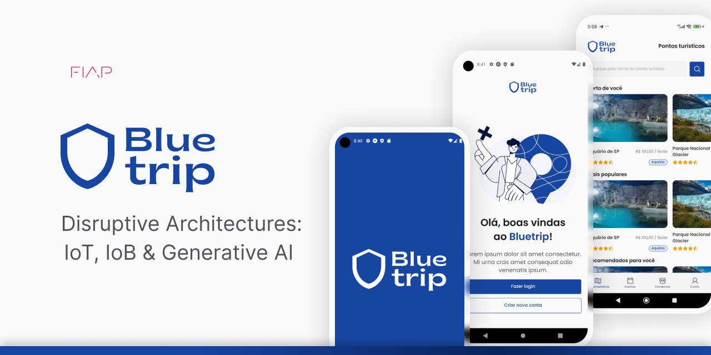

# 🔱 Bluetrip

## 💡 Explicação do projeto
Bluetrip é uma aplicação mobile de turismo focada em oceanos, rios e lagos. O objetivo principal é fornecer uma experiência enriquecedora para turistas e entusiastas da natureza, oferecendo informações detalhadas sobre pontos turísticos, eventos, comércios locais e espécies da fauna e flora aquática. A aplicação inclui:

- **Pontos Turísticos:** Informações sobre locais de interesse próximos a oceanos, rios e lagos, assim como cuidados a se tomar com o local, informações sobre preservação, dentre outros.
- **Eventos:** Agenda de eventos relacionados aos pontos turisticos.
- **Comércios:** Listagem de comércios locais, como restaurantes temáticos, lojas de equipamentos de mergulho, etc.
- **Scanner 3D:** Um scanner que renderiza modelos 3D acompanhados de informações sobre espécies ou partes do ponto turístico.
- **Identificador de Espécies:** Um classificador de espécies utilizando inteligência artificial para identificar e fornecer informações sobre diferentes espécies aquáticas.

## 🎥 Pré-visualização do projeto integrado
https://github.com/ericknathan/bluetrip-ai/assets/53922235/d2c5dd4c-3bc4-4899-9bff-4aef9d24cad2

## 👥 Equipe
Este projeto está sendo desenvolvido pelos seguintes membros:

- RM98110 - André Rohregger Machado (2TDSPV)
- RM99565 - Erick Nathan Capito Pereira (2TDSPV)
- RM550841 - Lucas Araujo Oliveira Silva (2TDSPW)
- RM551886 - Victor Luca do Nascimento Queiroz (2TDSPV)
- RM99455 - Vinícius Martins Torres Abdala (2TDSPV)

## 💻 Tecnologias
As principais tecnologias, bibliotecas, ecossistemas e frameworks incluídos no projeto são:

- [Python](https://www.python.org)
- [Keras](https://keras.io)
- [Tensorflow](https://www.tensorflow.org)
- [Numpy](https://numpy.org)
- [FastAPI](https://fastapi.tiangolo.com)
- [Uvicorn](https://www.uvicorn.org)
